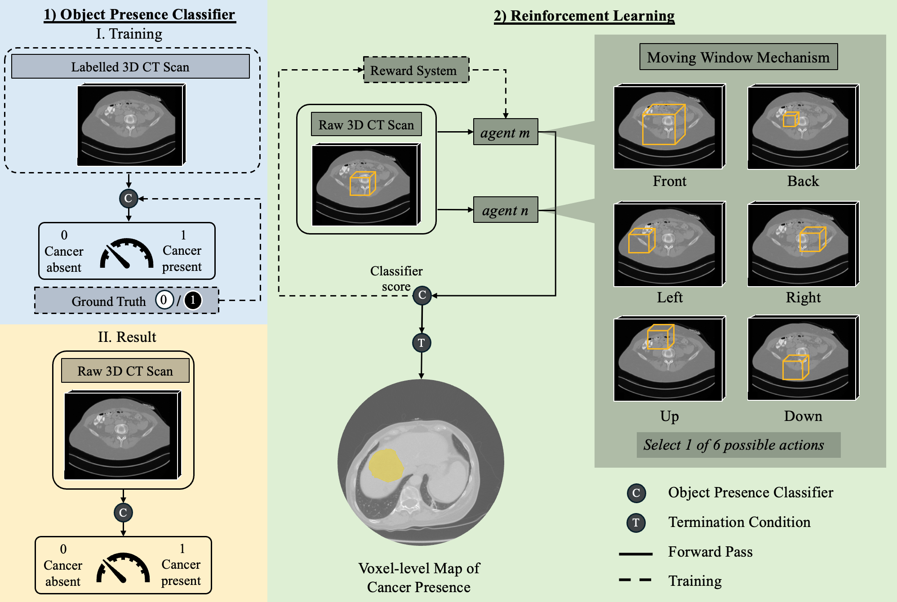

# SPARS: Self-Play Adversarial Reinforcement Learning for Segmentation of Liver Tumours


## Abstract
Accurate tumour segmentation is vital for targeted diagnostic and
therapeutic surgical procedures for cancer. Current tumour segmentation
methods involve manual delineation which is both labour-intensive and
subjective. Fully-supervised machine learning models aim to address
these issues, but require a large number of costly and often subjective
3D-voxel level labels for training. In this work, we propose a novel
framework called SPARS (Self-Play Adversarial Reinforcement
Learning for Segmentation of Liver Tumours), which utilises
an object presence classifier, trained on a small number of image-level
binary cancer presence labels, to localise cancerous regions on CT scans.
Such binary labels of patient-level cancer presence can be sourced more
objectively from biopsies and histopathology reports, enabling a more
objective cancer localisation on medical images. Evaluating with real
patient data, we observed that SPARS yielded a mean dice score of
77.3 ± 9.4, which outperformed other weakly-supervised methods by
large margins. This performance was comparable with recent fully-
supervised methods that require voxel-level annotations. Our results
demonstrate the potential of using SPARS to reduce the need for
extensive human-annotated labels to detect cancer in real-world
healthcare settings.

## Method
We propose an adversarial reinforcement learning environment for
weakly-supervised segmentation where two agents compete to identify
ROIs in images. During training, each agent moves a window across the
image at every time step and receives a score from an object presence
classifier, which is pre-trained using binary, image-level labels of object
presence. This score determines the likelihood that the ROI falls within
this area and drives the reward signal to train the agents to maximise
localisation accuracy. An agent will receive a positive reward if its score
exceeds that of the other agent, and receive a negative reward otherwise.
The probability scores of each voxel in the segmentation map is initially
set to zero. As a window moves across a region in an image, the voxel
values within the window are updated to reflect the score received by the
classifier. These scores continue to accumulate until one of the agents
receives a predetermined score at a single time step or when a predefined
number of iterations has been completed. When the algorithm reaches
this termination condition, the agent assumes that a sufficient
localisation performance has been reached.



## Algorithm Parameters
### Object Presence Classifier Parameters

| **Parameters**            | **Details**           |
|---------------------------|-----------------------|
| Convolution layers         | 4                     |
| Fully connected layers     | 5                     |
| Input-size                 | 256 x 256 x 180       |
| Batch-size                 | 4                     |
| Epochs                     | 32                    |
| Optimiser                  | Adam                  |
| Criterion                  | Cross Entropy Loss    |
| Learning rate              | 0.001                 |

### SPARS Parameters

| **Parameters**               | **Details**                   |
|------------------------------|-------------------------------|
| Input-size*                   | 256 x 256 x 180              |
| Batch-size                    | 8                            |
| Epoch                         | 1                            |
| Agent Model                   | Proximal Policy Optimisation |
| Competitor Update Frequency** | 32                           |
| Iterations                    | 10,000                       |
| Action                        | 4-voxel span                 |

*Input size denotes the dimensions of the data used in the model.  
**Competitor Update Frequency refers to how often the competitor model is updated during training.

## Repository Overview

This repository contains the core implementation of SPARS along with experiment variants for classifier input size, reinforcement-learning thresholds, and window-size settings.

### Main components

- `best_RL.py`: Main RL environment and PPO training workflow for SPARS.
- `net_global.py`: Global model architecture definitions used by training scripts.
- `classifier_experiments/`: Classifier experiments across different input sizes.
- `RL_threshold_experiments/`: SPARS variants using different reward/termination thresholds.
- `RL_window_size_experiments/`: SPARS variants using different window sizes.
- `requirements.txt`: Dependency list for reproduction.
- `pyproject.toml`: Build and packaging metadata.

## Project Structure

```text
.
├── best_RL.py
├── net_global.py
├── pyproject.toml
├── requirements.txt
├── classifier_experiments/
│   ├── ex1_8in.py
│   ├── ex2_12in.py
│   ├── ex3_16in.py
│   ├── ex4_20in.py
│   └── ex5_24in.py
├── RL_threshold_experiments/
│   ├── 0.2_threshold.py
│   ├── 0.3_threshold.py
│   ├── 0.4_threshold.py
│   ├── 0.5_threshold.py
│   ├── 0.6_threshold.py
│   └── net_threshold.py
└── RL_window_size_experiments/
    ├── 8_8_8.py
    ├── 16_16_8.py
    ├── 32_32_16.py
    ├── 48_48_24.py
    ├── 64_64_32.py
    └── net_window_size.py
```

## Setting Up a Virtual Environment

1. **Create a virtual environment**:
    ```sh
    python3 -m venv venv
    ```

2. **Activate the virtual environment**:
    - On macOS and Linux:
        ```sh
        source venv/bin/activate
        ```
    - On Windows:
        ```sh
        venv\Scripts\activate
        ```

## Installing the Project
Install the project in editable mode:

```bash
pip install -e .
```

## Installing Dependencies
Install dependencies listed in `requirements.txt`:

```bash
pip install -r requirements.txt
```

## Running Experiments

Run the main SPARS training script:

```bash
python best_RL.py
```

Run experiment variants:

```bash
# Classifier input-size experiment
python classifier_experiments/ex4_20in.py

# RL threshold experiment
python RL_threshold_experiments/0.4_threshold.py

# RL window-size experiment
python RL_window_size_experiments/48_48_24.py
```

## Reproducibility Notes

- The current scripts expect local NIfTI data paths. Update dataset paths in scripts before running experiments.
- Ensure classifier checkpoint files (for example, `ex4_24in_weights.pth`) are available at expected paths.
- GPU configuration can be adjusted in scripts if required (for example, `CUDA_VISIBLE_DEVICES`).

## Citation

If you use SPARS in academic work, please cite the corresponding publication or preprint associated with this repository.

